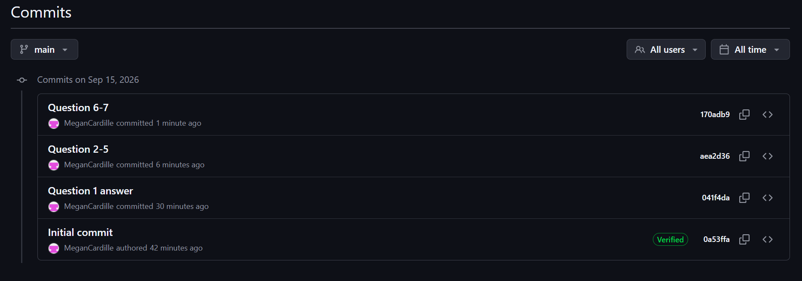

## Question 1

The message states "Already up to date" because what is in the document is not behind the saved document in Github.

## Question 2

Install package are run in the console because you don't need to save it to your document. 

## Question 3
You should put library in you file because you need to save it in your file.

## Question 4
```{r}
palmerpenguins::penguins
```
This does not work because we do not have the "palmerpenguins" package installed.

## Question 5
Both friends are right. I was able to run the code chunk after installing the "palmerpenguins" package. The library function allows the package to appear in your .qmd. It was not necessary for me to run the code. 

## Question 6
```{r}
library(dplyr)
```
```{r}
suppressWarnings(library(dplyr))
```

## Question 7
```{r}
iris2 <- iris

iris2 <- arrange(iris,Petal.Length)

head(iris2)
```

## Question 8


